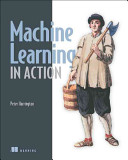

# Notes From Machine Learning In Action

## About this book

Check out this book on Google Books: [Machine Learning In Action](https://books.google.com/books?id=2d7RXwAACAAJ&dq=machine+learning+in+action&hl=en&sa=X&ved=0ahUKEwjj58yXzOfbAhUC7p8KHZvmAs0Q6AEIKTAA)

## Notes

Codes in this notebook are based on the provided codes from the [book website](https://www.manning.com/books/machine-learning-in-action). Minor modifications are made to apply these codes to Python 3.x.

## Questions

> Some of my questions here.

## Contents

* [Chapter 1 - Machine Learning Basics](c1-machine-learning-basics.md)
* [Chapter 2 - Classifying with k-Nearest Neighbors](c2-classifying-with-knearest-neighbors.md)
* [Chapter 3 - Splitting datasets one feature at a time: decision trees](c3-decision-trees.md)
* [test](c3-decision-trees.ipynb)
