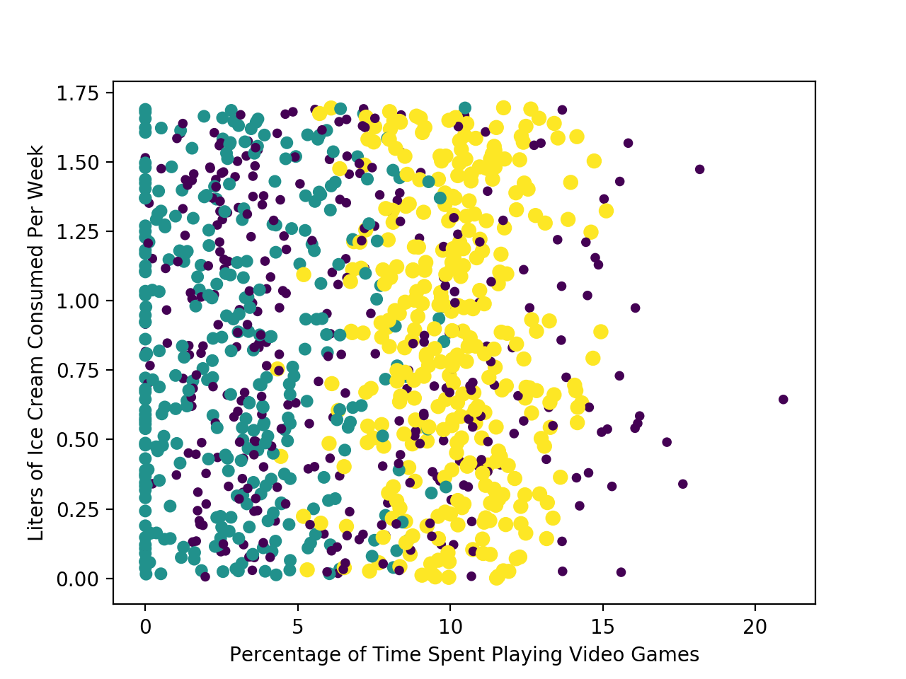

# Chapter 2 - Classifying with k-Nearest Neighbors

## Classifying with distance measurements

> k-Nearest Neighbors
> - Pros: High accuracy, insensitive to outliers, no assumptions about data
> - Cons: Computationally expensive, requires a lot of memory
> - Works with: Numeric values, nominal values

The first machine-learning algorithm is k-Nearest Neighbors (kNN). When given a new piece of data, we compare the new piece of data with our training set. We look at the k most similar pieces of data and take a majority vote from the k pieces of data, and the majority is the new class we assign to the data we were asked to classify.

### Prepare: importing data with Python

* Create a Python module: *kNN.py*

    ```Python
    from numpy import *
    import operator

    def createDataSet():
        group = array([[1.0, 1.1], [1.0, 1.0], [0, 0], [0, 0.1]])
        labels = ['A', 'A', 'B', 'B']
    return group, labels
    ```

### Putting the kNN classification algorithm into action

* Function *classify0()*

    ```Python
    def classify0(inX, dataSet, labels, k):
        dataSetSize = dataSet.shape[0]
        diffMat = tile(inX, (dataSetSize, 1)) - dataSet
        sqDiffMat = diffMat ** 2
        sqDistances = sqDiffMat.sum(axis = 1)
        distances = sqDistances ** 0.5
        sortedDistIndicies = distances.argsort()
        classCount = {}
        for i in range(k):
            voteIlabel = labels[sortedDistIndicies[i]]
            classCount[voteIlable] = classCount.get(voteIlable, 0) + 1
        sortedClassCount = sorted(classCount.iteritems(), key=operator.itemgetter(1), reverse=True)
        return sortedClassCount[0][0]
    ```

### How to test a classifier

Calculate **error rate** using test set.

## Example: improving matches from a dating site with kNN

### Prepare: parsing data from a text file

* Function *file2matrix()*

    ```Python
    def file2matrix(filename):
        fr = open(filename)
        numberOfLines = len(fr.readlines())
        returnMat = zeros((numberOfLines, 3))
        classLabelVector = []
        fr = open(filename)
        index = 0
        labels = {'didntLike': 1, 'smallDoses': 2, 'largeDoses': 3}
        for line in fr.readlines():
            line = line.strip()
            listFromLine = line.split('\t')
            returnMat[index, :] = listFromLine[0:3]
            # value is converted to integer in the book, it doesn't work on my system
            classLabelVector.append(labels[listFromLine[-1]])
            index += 1
        return returnMat, classLabelVector
    ```

### Analyze: creating scatter plot with Matplotlib

* Plot the data in Python console

    ```Python
    >>> import matplotlib
    >>> import matplotlib.pyplot as plt
    >>> fig = plt.figure()
    >>> ax = fig.add_subplot(111)
    >>> ax.scatter(datingDataMat[:, 1], datingDataMat[:, 2])
    >>> plt.show()
    ```

* Customize the markers

    ```Python
    ax.scatter(datingDataMat[:, 1], datingDataMat[:, 2], 15.0*array(datingLabels), 15.0*array(datingLabels))
    ```

    

### Prepare: normalizing numeric values

When dealing with values that lie in different range, it's common to normalize them. Common ranges to normalize them to are 0 to 1 or -1 to 1.

* Function *autoNorm()*

    ```Python
    def autoNorm(dataSet):
        minVals = dataSet.min(0)
        maxVals = dataSet.max(0)
        ranges = maxVals - minVals
        normDataSet = zeros(shape(dataSet))
        m = dataSet.shape[0]
        normDataSet = dataSet - tile(minVals, (m, 1))
        normDataSet = normDataSet/tile(ranges, (m, 1)) # element-wise division
        return normDataSet, ranges, minVals
    ```

    In Numpy, / operator stands for element-wise division. You need to use *linalg.solve(matA, matB)* for matrix division.

### Test: testing the classifier as a whole program

To test the accuracy of the algorithm,  we take 90% of the existing data to train the classifier. Then we take the remaining 10% to test the classifier and see how accurate it is. The 10% should be randomly selected. Our data isn't stored in a specific sequence, so you can take the first 10%.

* Function *datingClassTest()*

    ```Python
    def datingClassTest():
        hoRatio = 0.10
        datingDataMat, datingLabels = file2matrix('datingTestSet.txt')
        normMat, ranges, minVals = autoNorm(datingDataMat)
        m = normMat.shape[0]
        numTestVecs = int(m*hoRatio)
        errorCount = 0.0
        for i in range(numTestVecs):
            classifierResult = classify0(normMat[i, :], normMat[numTestVecs: m, :], datingLabels[numTestVecs: m], 3)
            print('The classifier came back with: {:d}, the real answer is: {:d}'.format(classifierResult, datingLabels[i]))
            if classifierResult != datingLabels[i]:
                errorCount += 1.0
        print("The total error rate is: {:f}".format(errorCount / float(numTestVecs)))
    ```

* Sample Output

    ```
    >>> kNN.datingClassTest()
    The classifier came back with: 3, the real answer is: 3
    The classifier came back with: 2, the real answer is: 2
    The classifier came back with: 1, the real answer is: 1
    The classifier came back with: 1, the real answer is: 1
    The classifier came back with: 1, the real answer is: 1
    ...
    The classifier came back with: 2, the real answer is: 2
    The classifier came back with: 3, the real answer is: 3
    The classifier came back with: 2, the real answer is: 2
    The classifier came back with: 1, the real answer is: 1
    The classifier came back with: 3, the real answer is: 3
    The total error rate is: 0.050000
    ```

### Use: putting together a useful system

Now that we've tested the classifier on our data, it's time to use it to actually classify people for Hellen. Hellen will find someone on the dating site and enter his information. The program predicts how much she'll like this person.

* Function *classifyPerson()*

    ```Python
    def classifyPerson():
        resultList = ['not at all', 'in small doses', 'in large doses']
        percentTats = float(input('percentage of time spent playing video games?'))
        ffMiles = float(input('frequent flier miles earned per year?'))
        iceCream = float(input('liters of ice cream consumed per year?'))
        datingDataMat, datingLabels = file2matrix('datingTestSet.txt')
        normMat, ranges, minVals = autoNorm(datingDataMat)
        inArr = array([ffMiles, percentTats, iceCream])
        classifierResult = classify0((inArr-minVals)/ranges, normMat, datingLabels, 3)
        print("You will probably like this person: ", resultList[classifierResult - 1])
    ```

## Example: a handwriting recognition system

### Prepare: converting images into test vectors

We'll take the 32x32 matrix that is each binary image and make it a 1x1024 vector. After this, we can apply it to the existing classifier.

* Function *img2vector()*

    ```Python
    def img2vector(filename):
        returnVect = zeros((1, 1024))
        fr = open(filename)
        for i in range(32):
            lineStr = fr.readline()
            for j in range(32):
                returnVect[0, 32*i+j] = int(lineStr[j])
        return returnVect
    ```

## Test: kNN on handwriting digits

* Function *handwritingClassTest()*

    ```Python
    def handwritingClassTest():
        hwLabels = []
        trainingFileList = listdir('trainingDigits')
        m = len(trainingFileList)
        trainingMat = zeros((m, 1024))
        for i in range(m):
            fileNameStr = trainingFileList[i]
            fileStr = fileNameStr.split('.')[0]
            classNumStr = int(fileStr.split('_')[0])
            hwLabels.append(classNumStr)
            trainingMat[i, :] = img2vector('trainingDigits/{:s}'.format(fileNameStr))
        testFileList = listdir('testDigits')
        errorCount = 0
        mTest = len(testFileList)
        for i in range(mTest):
            fileNameStr = testFileList[i]
            fileStr = fileNameStr.split('.')[0]
            classNumStr = int(fileStr.split('_')[0])
            vectorUnderTest = img2vector('testDigits/{:s}'.format(fileNameStr))
            classifierResult = classify0(vectorUnderTest, trainingMat, hwLabels, 3)
            print("The classifier came back with: {:d}, the real answer is: {:d}".format(classifierResult, classNumStr))
            if classifierResult != classNumStr:
                errorCount += 1
        print("\nThe total number of errros is: {:d}".format(errorCount))
        print("\nThe total error rate is: {:f}".format(errorCount/float(mTest)))
    ```
